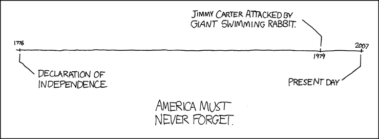

## Time, Space, Narrative {#timespacenarrative}

Human beings experience all things in time, as a series of successive moments one after the other after the other. No matter what one experiences, be it pain, a cup of tea, or a heart-to-heart chat, it will be experienced in time.

Picture each instant of time laid end-to-end. This is known as a “timeline”. We think of time as a line so often that our primary visualization has the word “line” in the name. The experience of time is linear.

Space is three-dimensional. Yet when we traverse space, we do so linearly. Science fiction is rife with people bypassing the restrictions of linear transport, but  in reality teleportation eludes us. 

A narrative is a relation of events. Since from a human perspective events occur in time and space, narratives are often told in a linear manner. 

A narrative can have multiple purposes. Some narratives are purely factual, meant only to convey real events as accurately as possible. Other narratives are fictional. The motives for telling these types of narrative can be less clear. Fables convey morals. Science fiction thrills. Noir contemplates the dark underbelly of man. For these types of stories, linearity is not required, and may even undermine the strength of the story itself.

## The Violation of Linearity {#violation} 

Hypertext violates the linearity of time, space, and narrative.

Most writings cohere along a timeline of events. While it is possible to have a non-linear presentation of time in non-hypertext writing, the act of flitting from node to node in hypertext at least provides a high probability of reading events out of chronological order. 

In hypertext, each node jumps to the forefront. It is not reached in a linear manner as in traditional text. Whereas a page is next to another page in a book, a node is not “next” to another node. It has teleported onto the screen, like the node that came before it and the node that will come after.

Hypertext jumbles the components of the narrative all about. Whereas in a traditional nonlinear narrative the author carefully orders the events to convey the story as he wishes it to be told, in a hypertext the author relinquishes that order to the whim of the reader[^cf1].

## Cognitive Dissonance {#dissonance}

The greatest burden laid upon readers of hypertext is managing the added dimensions of nonlinearity beyond those inherent in the telling of the narrative. Keeping track of goings on in a nonlinear chronology is one thing. Keeping track of goings on in a nonlinear narrative, the nonlinearity of which may or may not have been foreseen by the author; in a physical space that flattens and renders moot any perceptions of linearity; in a setting with few markers to indicate how much of the work one has read, or where in the narrative one stands: these are different kettles of fish entirely.

Is the added cognitive overhead of ergodic hypertext worth it? What do these added complexities bring to a text? What do these additional experiences provide the reader that she could not have gotten otherwise?

I find the diffusion of the narrative's chronology to be isolating. Each node feels disjointed from the node I just read. A character is referenced from node to node, but half of their actions are incomprehensible. While as a reader of doorstop-sized trilogies I have grown accustomed to keeping lots of disparate information about the narrative in memory, I now have to keep twice as much in mind[^cf2] as I would otherwise. Hypertext stories are much less likely to cohere in my brain than more traditional narratives.

When I “finish” a work of hypertext, I always find myself wondering if I have indeed finished it. Is there another, more satisfying branch of the story I ought to  have read? Did I neglect to click on a node that would have provided me with just the kick of additional context needed to more completely comprehend the author's intent? 

What if I managed to build a topology of the work, a map of each and every node, of all the links from node to node? What if I read each of the paths that can be taken? How could I compare them? Surely the author didn't intend for me to go through the hassle of attempting to determine the property lines of the work, the acreage of the writing, much less go in and start getting information on the foundation from an inspector, on the plumbing from a plumber, etc. etc. While that may be a more complete understanding of the writing, surely the author hopes or realizes that the reader might only read one path and toss the rest of the electrons aside, teleporting them back from whence they came[^cf3].

[^cf1]: There is a rather large caveat to this: there exist hypertexts that instead of providing a multiplicity of choices to the reader, leaving him an oblique world to explore on unguided paths, instead railroad him to a path, nudging him to follow a more traditional narrative with node traversal rather than page turns.

[^cf2]: A mind which has not gained any appreciable capacity for memory for quite some time.

[^cf3]: Which, if you had any sense, you would have done before reading this footnote.
